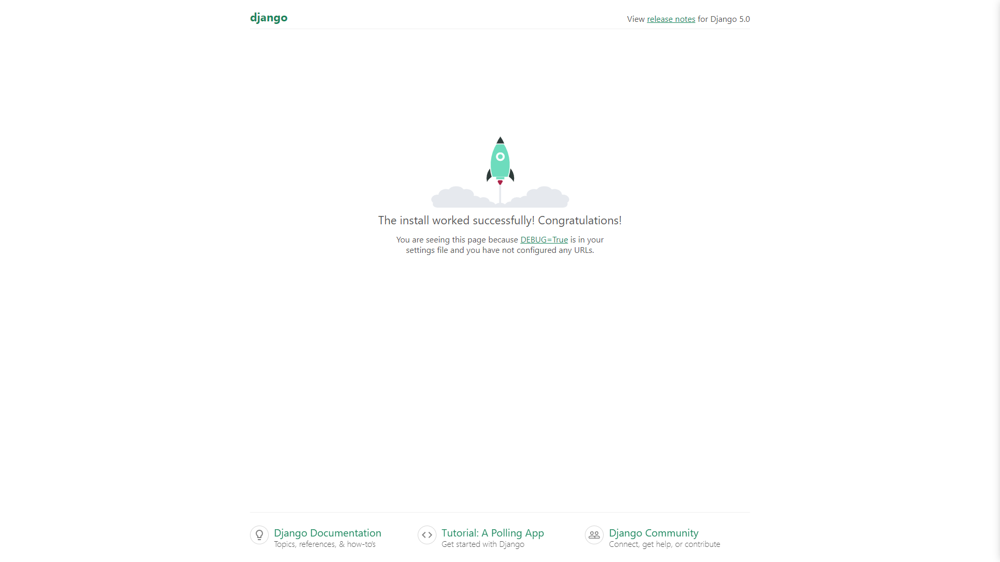

## Documented Development Workflow (DDW)

The Documented Development Workflow (DDW) is a method designed to help beginner coders learn effectively by documenting each step of the development process. This approach aims to prevent beginners from getting stuck in a cycle of following tutorials without understanding how to apply their knowledge independently. By using DDW, you will:

- Document your thought process and decisions.
- Keep track of dependencies and tools used.
- Create a to-do list with detailed steps and research findings.
- Develop a project incrementally, reflecting on and learning from each step.

**Note**: The objective is to **ONLY** use _ChatGPT_ for overall understanding, documentation purposes, and guidance, but not to rely on it for actual code generation to avoid causing dependence as a new developer.

## Project Overview

- **Project Name**: SustainIQ
- **Description**: A platform for monitoring, analyzing, and automating green technology applications.
- **Technologies Used**: Python, Django, Next.js
## Dependencies

- **Django**: Web framework for building the backend.

## To-Do List

### Current Tasks

1. **Task**: Setup Virtual Environment (create isolated Python environments for projects to not affect other projects on your local system)
   - **Use**: In my case I'm using `python3.12 -m venv venv` then `source venv/bin/activate` for stability to ensure future latest versions do not break anything by updating randomly
  - **Note** : Going forward, ensure that any installations are being done under the (venv) in your terminal. If you need to exit venv ( you can also just use another terminal ) you can type `deactivate`. If you want to enter Venv again, use `source venv/bin/activate`.

2. **Task**: Setup Backend Framework
   - **Quickstart**: Refer to the [Django Quickstart Guide](https://docs.djangoproject.com/en/5.0/intro/tutorial01/).
   - **Steps** : 
   -  come back after installing Django ( I installed the official option ) https://docs.djangoproject.com/en/5.0/topics/install/#installing-official-release `python -m pip install Django`

   - **Error Handling**: If you encounter any import errors in VS Code:
     1. Open the Command Palette (Ctrl+Shift+P on Windows/Linux or Cmd+Shift+P on macOS).
     2. Select `Python: Select Interpreter`.
     3. Choose the Python interpreter from your virtual environment (e.g., `.venv/bin/python`).
     Now the error should be resolved.

# to be formatted correctly later

  3. `django-admin startproject backend_sustainiq`
  4. changed outer dir name since docs state we can change this "The outer mysite/ root directory is a container for your project. Its name doesn’t matter to Django; you can rename it to anything you like."
  5. Now we confirm that django is working correctly: `cd backend` then `python manage.py runserver`. 
  
  

  6. Following along tutorial example to learn Django ( later on can we will delete Polls and make our first of many apps (Weather Data Logger) ) `python manage.py startapp polls`
  7. Following these instructions ( https://docs.djangoproject.com/en/5.0/intro/tutorial01/#write-your-first-view ), When we do the Global url that would be inside (backend_sustainiq) AKA the inner 'mysite'.

## Environment Setup

- Users need to set up their own environment variables for AWS credentials and other configurations.
- Refer to the `.env.example` file with placeholders for necessary environment variables.

## Lambda Functions

- Users need to create their own Lambda functions for certain AWS integrations.
- Refer to any AWS boto specific files and replace with your own Creds ( likely in Lambda if serverless is possible )
## Resources

- **Django**: [Django Documentation](https://docs.djangoproject.com/en/stable/)
- **AWS SDK for Python (Boto3)**: [Boto3 Documentation](https://boto3.amazonaws.com/v1/documentation/api/latest/index.html)
- **Next.js**: [Next.js Documentation](https://nextjs.org/docs)
- **Object-Oriented Programming**:
  - [FreeCodeCamp: Object-Oriented Programming in Python](https://www.freecodecamp.org/news/object-oriented-programming-in-python/)
  - [Real Python: Object-Oriented Programming in Python](https://realpython.com/python3-object-oriented-programming/)

## Useful Commands / Tools During Development

```bash
pip freeze > requirements.txt
